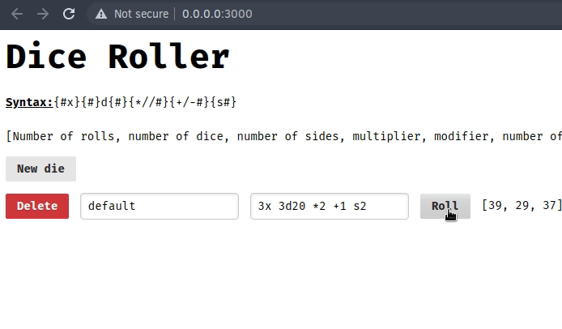

# DiCast

This is a dice roller web application designed for use in games such as DND. It allows users to create a list of dice, with their names and corresponding dice roll specification.

**NOTE:** *The project currently only works on Rust nightly since it uses Rocket, an unstable Rust framework that requires unstable Rust features.*

Licensed under GPLv3.
